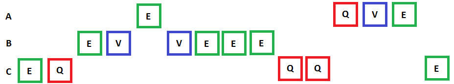
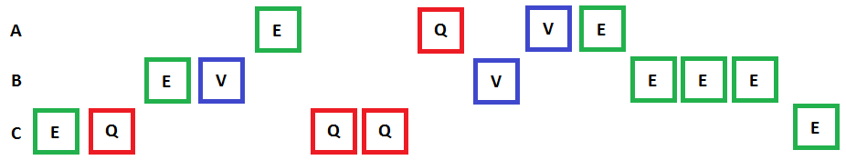
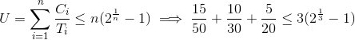
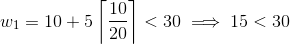
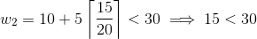
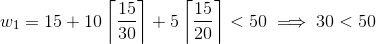
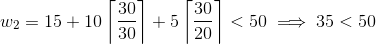
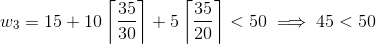
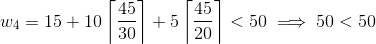
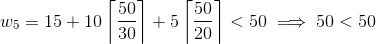

Exercise 9 : Scheduling
=======================

Properties
----------
**Task 1:**
 1. Why do we assign priorities to tasks?
      - This is done to better allocate resources (such as processing time) to the tasks that need it the most, which may increase the performance of the system.
 2. What features must a scheduler have for it to be usable for real-time systems?
      - In general it must have the ability to pause running processes, maintain and manage a queue of running processes and start new processes. In a real-time system we get the added constraints of the scheduler also being predictable and analysable so that we can mathematically prove that all tasks will meet their deadlines.

Inversion and inheritance
-------------------------

*Task set 1:*

| Task | Priority   | Execution sequence | Release time |
|------|------------|--------------------|--------------|
| a    | 3          | `E Q V E`          | 4            |
| b    | 2          | `E V V E E E`      | 2            |
| c    | 1 (lowest) | `E Q Q Q E`        | 0            |

*Where:*
 - `E` : Executing
 - `Q` : Executing with resource Q locked
 - `V` : Executing with resource V locked

**Task 2:** Draw Gantt charts to show how task set 1 executes:
 1. Without priority inheritance
 
 2. With priority inheritance
  

**Task 3:** Explain:
 1. What is priority inversion? What is unbounded priority inversion?
      - A priority inversion occurs when a high-priority process has to wait for a low-priority one to finish, for example due to it blocking a shared resource that the high-priority one needs. An unbounded priority inversion is one that can cause the high priority process to wait forever due to resource locks.
 2. Does priority inheritance avoid deadlocks?
      - Yes, it may, as long as the priority the blocking task inherits is high enough to prevent it from being blocked from finishing its work on the resource. This is, however, only the case when two (or more) tasks are sharing one resource - if two tasks are sharing two or more resources they may still end up waiting forever for the other task to release the resource.

Utilization and response time
-----------------------------

*Task set 2:*

| Task | Period (T) | Exec. Time (C) |
|------|------------|----------------|
| a    | 50         | 15             |
| b    | 30         | 10             |
| c    | 20         | 5              |

**Task 4:**
1. There are a number of assumptions/conditions that must be true for the utilization and response time tests to be usable (The "simple task model"). What are these assumptions? Comment on how realistic they are.
     - We need to have a fixed, predictable set of tasks, with no random/unpredictable tasks
          - This is fairly realistic for many embedded systems. The tasks we are going to run are generally well-defined in advance.
     - The tasks need to be periodic with known periods
          - Realistic in many systems; tasks often run on fixed intervals.
     - The tasks need to be independent
          - A fairly reasonable and realistic requirement; tasks seldom directly depend on each other, particularly not in embedded systems.
     - The task switching times need to be negligble and/or fixed
          - This is not necessarily realistic. If a task returns with a deep call stack remaining after it, or with connections to external resources that need to finish/clean up before switching to a new task, this may not be the case on most systems.
     - All tasks run on a single thread
          - Completely realistic.
     - Task deadlines are absolute and fixed
          - Also far from always the case unless you are in a hard real time system, so this is not a very realistic constraint for most systems.
     - System needs to utilize rate-monotonic scheduling (shorter task duration leads to higher task priority)
          - Sure. This is a fairly realistic (but restrictive) design decision.
2. Perform the utilization test for task set 2. Is the task set schedulable?
     - , 
     - The utilization test fails so the system may not be schedulable.
3. Perform response-time analysis for task set 2. Is the task set schedulable? If you got different results than in 2), explain why.
     - NB: All instances of the less than symbol should be read as the less than or equal symbol in the equations below.
     - Task c (shortest execution time, highest priority)
          - 
     - Task b (second shortest execution time, second highest priority)
          - 
          - 
          - 
     - Task a (longest execution time, lowest priority)
          - 
          - 
          - 
          - 
          - 
          - 
     - The task set is thus schedulable. The reason for why we can get a different result here from in 4.2 is due to the utilization test only being a sufficient condition, but not a necessary one; it can fail despite the task set being schedulable.
